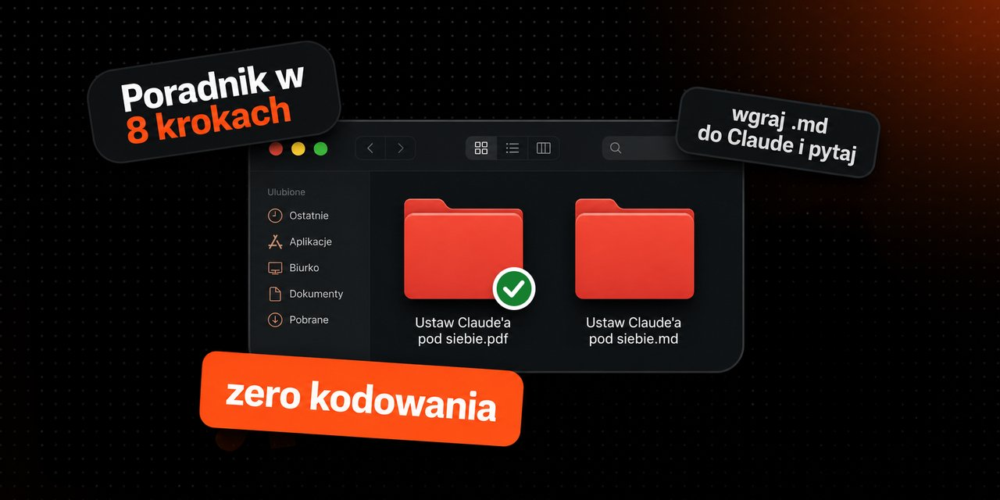

# Ustaw Claude'a pod siebie

Praktyczny poradnik w 8 krokach — bez kodowania, bez technikaliów. Konfiguracja, która sprawia że Claude przestaje być generycznym chatbotem i zaczyna działać jak asystent, który zna Ciebie i Twoją pracę.

## Co środku

- Memory, Instructions, Projects, konektory, skills, Web Search — wszystko opisane gdzie kliknąć i po co
- Gotowe szablony do skopiowania (instrukcje o sobie, głos i zasady)
- Tabela modeli: który wybrać do jakiego zadania, żeby nie spalić limitu
- Sekcja „jak rozmawiać" — konkretne wzorce promptów, nie teoria

## Formaty

| Plik | Do czego |
|------|----------|
| `ustaw-claudea-pod-siebie.md` | Wgraj do projektu Claude / innego LLM i ucz się z niego interaktywnie |
| `Ustaw-Claudea-pod-siebie.pdf` | Czytelna wersja do przeglądania, drukowania, przesłania komuś |

Oba pliki zawierają tę samą treść. Markdown jest zoptymalizowany pod LLM — nie ma ozdobników, jest czysty tekst z nagłówkami.

## Dla kogo

Właściciele firm, freelancerzy, marketerzy — każdy kto używa Claude'a do pracy i chce wyciągnąć z niego więcej bez płacenia za plan, którego nie potrzebuje.

---

Autor: Heredero · [github.com/heredero7](https://github.com/heredero7)
